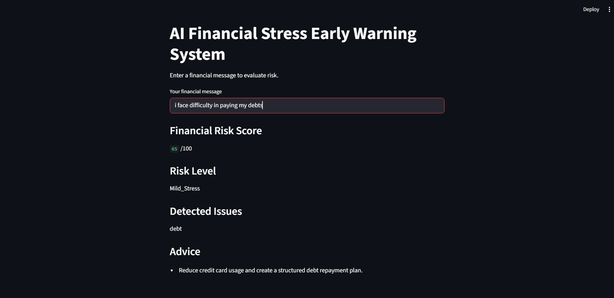

# 💡 AI Financial Stress Early Warning System

An intelligent NLP-powered system that detects early signs of financial stress from user conversations and provides real-time risk assessment with actionable financial guidance.

---

## 🚀 Overview

Financial stress often builds silently before becoming a serious problem. This project introduces an AI-driven early warning system that analyzes user financial behavior through natural language and predicts potential financial risk.

By combining Machine Learning with rule-based intelligence, the system identifies patterns such as overspending, debt pressure, and low savings — and provides proactive recommendations.

---

## 🎯 Problem Statement

Most individuals fail to recognize early warning signs of financial instability until it becomes critical. There is a lack of accessible tools that can:

* Interpret financial behavior in real-time
* Detect early financial stress signals
* Provide personalized, actionable insights

This system bridges that gap using AI.

---

## ✨ Key Features

✔ NLP-based financial stress classification
✔ Multi-signal detection (debt, savings, spending patterns)
✔ Financial Risk Score (0–100 scale)
✔ Hybrid AI architecture (ML + rule-based logic)
✔ Interactive chatbot interface
✔ Web-based deployment using Streamlit
✔ Personalized financial advice generation

---

## 🧠 Machine Learning Pipeline

```text
Dataset
  ↓
Text Preprocessing
  ↓
TF-IDF Vectorization
  ↓
Logistic Regression Model
  ↓
Stress Level Prediction
```

---

## ⚙️ System Architecture

```text
User Input
   ↓
Streamlit Web Interface
   ↓
Stress Prediction Model (ML)
   ↓
Signal Detection Engine (Rule-based NLP)
   ↓
Risk Scoring Engine
   ↓
Financial Advice Generator
   ↓
User Output
```

---

## 📊 Dataset

A custom-built dataset of labeled financial statements was used, consisting of:

* **No_Stress**
* **Mild_Stress**
* **High_Stress**

Each entry also includes financial behavior signals such as:

* Overspending
* Loan Pressure
* Low Savings
* Debt
* Cash Shortage
* Investment Behavior
* Financial Control

---

## 🤖 Model Details

* **Algorithm:** Logistic Regression
* **Feature Extraction:** TF-IDF
* **Reason for Selection:**

  * Efficient for small datasets
  * Strong baseline for text classification
  * Fast training and inference

---

## 📈 Example Output

**Input:**

> I cannot pay my credit card bill this month

**Output:**

```text
Financial Risk Score: 95 / 100
Risk Level: High_Stress
Detected Issues: debt

Advice:
• Reduce credit card usage  
• Create a structured debt repayment plan  
```

---

## 🛠️ Tech Stack

* Python
* Scikit-learn
* Pandas
* Streamlit
* Natural Language Processing (TF-IDF)

---

## 📁 Project Structure

```text
AI-Financial-Stress-Early-Warning-System
│
├── Dataset
├── models
│   ├── stress_model.pkl
│   └── vectorizer.pkl
│
├── src
│   ├── train_model.py
│   ├── chatbot.py
│   └── app.py
│
├── screenshots
│   └── app.png
│
├── README.md
└── requirements.txt
```

---

## 🖥️ Application Interface



---

## 🔮 Future Enhancements

* Integration with transformer-based models (BERT)
* Sentiment analysis for emotional financial signals
* Real-time financial tracking integration
* Personalized financial planning dashboard
* Multi-language support

---

## 👩‍💻 Author

**Dnyaneshwari Gandhre**
AI & Machine Learning Enthusiast

---

## 🌟 Project Highlights

This project demonstrates:

* End-to-end ML pipeline development
* NLP-based classification system
* Hybrid AI system design
* Real-world problem-solving approach
* Deployment-ready AI application

---
